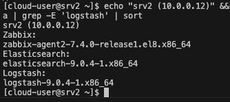
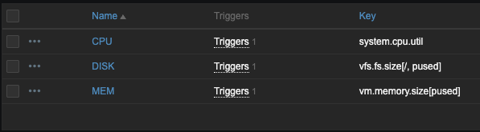

# dz_r7_1

### Тестовые задания для кандидата на позициюсистемного инженера (с уклоном на мониторинг)
#### Задание блок 1

Имеются три сервера:
Сервер 1: работает на Debian 11, запущен веб-сервер Nginx, база данных PostgreSQL.

Zabbix Agent 2: 7.4.0
PostgreSQL: 16.9 (c установленой базой zabbix)
Nginx: с простым сайтом "Welcome to srv1"

Сервер 2: работает на CentOS 8, используется для хранения логов, установлены службы Elasticsearch и Logstash.

Zabbix Agent2: zabbix-agent2-7.4.0-release1.el8.x86_64
Elasticsearch: elasticsearch-9.0.4-1.x86_64
Logstash: logstash-9.0.4-1.x86_64

Сервер 3: работает на RedOS 7.3, установлен Zabbix агент.

Zabbix Agent: 7.0.12

#### Задание 1.1 
Создайте шаблон в Zabbix для мониторинга загрузки процессора, памяти и дискового пространства на всех серверах.
**Решение**

1. CPU 
Ключ метрики: system.cpu.load[all,avg1]
Отслеживание средней загрузки всех ядер процессора за 1 минуту (в зависимости от потребности можно менять на определенные ядра или увеличить время средней , для плавающей нагрузки).
Например: avg(//system.cpu.load[percpu,avg1,0], 120m)  - 1 ядро с средней в 2 часа
2. MEM
Ключ метрики: vm.memory.size[pused]
Отслеживание использования оперативной памяти в процентах от общего объёма (без кеша) Так же хорошо смотреть утечки (avg(//vm.memory.size[pused], 480m) - last(//vm.memory.size[pused]) > 10).
3. FREE DISK
Ключ метрики: vfs.fs.size[/,pfree]
Отслеживание свободного места на корне (дополнительно можно подключить контроль заполнения за сутки (last) или скорость чтения/запись (ops))

#### Задание 1.2 
Добавьте в шаблон триггеры, которые будут срабатывать при достижении определенных порогов (например, использование процессора более 85%, памяти более 90%, заполнение диска более 95%).
**Решение**

Дополнительно я бы сделал двухуровневые триггеры, для Warning и High, а для диска бы добавил еще тригер на численое значение (free)

#### Задание 1.3 *
Создайте на основе шаблона карту сети, отображающую статус серверов и основные метрики на одном экране.

#### Задание блок 2
1.	Напишите скрипт (на Bash/Python), который будет проверять наличие обновлений для Zabbix агентов на всех серверах и отправлять уведомление через Telegram в случае доступности обновления. Скрипт должен работать на одной или нескольких (желательно) из ОС на выбор: CentOS, RedOS, Astra Linux, Alt Linux, Debian, Ubuntu.
**Решение**
Скрипт проверяет версии Zabbix агентов на удалённых серверах и отправляет уведомление через Telegram при обнаружении доступных обновлений (доступность обновлений проверяет инженер на сайте, но можно автоматизировать через запрос к репозитория или парс сайта).

[Описание скрипта](https://github.com/RomanDiskTop/dz_r7_1/blob/main/BASH.md)

[Скрипт](https://github.com/RomanDiskTop/dz_r7_1/blob/main/app/check_zabbix_update_new.sh)

2.	Разработайте сценарий (playbook) для Ansible, который автоматизирует установку и обновление Zabbix агентов на серверах.
**Решение**
[inventory.ini](https://github.com/RomanDiskTop/dz_r7_1/blob/main/app/inventory.ini)

Плейбук обновляет или устанавливает Zabbix агента на сервера

[Плейбук Debian/Ubuntu](https://github.com/RomanDiskTop/dz_r7_1/blob/main/app/zabbix-agent.yml)

[Плейбук CentOS](https://github.com/RomanDiskTop/dz_r7_1/blob/main/app/zabbix-agent-centos8.yml) Доделать

#### Задание блок 3

#### Задание 3.1 
Настройте веб-мониторинг сайтов на Сервере 1 и Сервере 3 с использованием шаблонов Zabbix.
**Решение**

#### Задание 3.2 
Добавьте в шаблоны проверки доступности (HTTP/HTTPS) и времени ответа сайтов. Настройте уведомления при недоступности сайтов или если время ответа превышает заданное значение.

**Решение**

#### Задание 3.3 
Создайте отчет, отображающий время доступности и среднее время отклика для сайтов за последние 7 дней.

