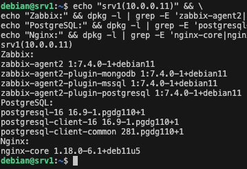
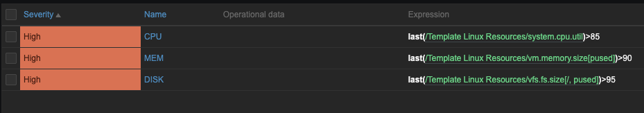

# dz_r7_1

[Инфраструктура](https://github.com/RomanDiskTop/dz_r7_1/blob/main/infrastructure)

#### Задание блок 1

Имеются три сервера:
Сервер 1: работает на Debian 11, запущен веб-сервер Nginx, база данных PostgreSQL.



Zabbix Agent 2: 7.4.0
PostgreSQL: 16.9
Nginx: с простым сайтом "Welcome to srv1"

Сервер 2: работает на CentOS 8, используется для хранения логов, установлены службы Elasticsearch и Logstash.


Zabbix Agent2: zabbix-agent2-7.4.0-release1.el8.x86_64
Elasticsearch: elasticsearch-9.0.4-1.x86_64
Logstash: logstash-9.0.4-1.x86_64

Сервер 3: работает на RedOS 7.3, установлен Zabbix агент.


Zabbix Agent: 7.0.12

#### Задание 1.1 
Создайте шаблон в Zabbix для мониторинга загрузки процессора, памяти и дискового пространства на всех серверах.
**Решение**


1. CPU 
Ключ метрики: system.cpu.util
Показывает общую загрузку процессора в процентах


2. MEM
Ключ метрики: vm.memory.size[pused]
Отслеживание использования оперативной памяти в процентах от общего объёма (без кеша)


3. DISK
Ключ метрики: vfs.fs.size[/,pused]
Отслеживание заполненого места на корне

#### Задание 1.2 
Добавьте в шаблон триггеры, которые будут срабатывать при достижении определенных порогов (например, использование процессора более 85%, памяти более 90%, заполнение диска более 95%).
**Решение**



#### Задание 1.3 *
Создайте на основе шаблона карту сети, отображающую статус серверов и основные метрики на одном экране.


Данные метрики подходят только для тестовой среды, а для боевой инфраструктуры лучше использовать более маштабные метрики, например:

**CPU:** Вместо одной общей загрузки процессора лучше мониторить нагрузку по отдельным видам: `user`, `system`, `iowait`, `idle`. Это помогает понять, чем именно занят процессор: работает ли он с приложениями, ядром системы или простаивает в ожидании ввода-вывода. Также имеет смысл использовать средние значения за период (например, `avg5`, `avg15`) для отслеживания плавающей или нарастающей нагрузки.

**MEM (память):** Здесь важно следить не только за общей загрузкой памяти, но и за использованием буферов, кэша и swap. Это позволяет отличить нормальную работу системы от ситуаций, когда она действительно начинает "умирать", например, из-за утечки памяти.

**DISK:** Помимо заполненности файловой системы, критично контролировать скорость чтения/записи, задержки (latency) и IOPS. Это особенно важно для серверов с базами данных, где даже небольшие проблемы со стореджем могут сильно повлиять на производительность приложений.

 Важно расширить зону триггеров хотябы до трёх уровней:
1. Предупреждение (вероятна проблема)
2. Проблема
3. Критично (сервер недоступен)

Как пример триггеры, которые учитывают поведение метрик во времени — например, для отслеживания утечек памяти:

```
{Template Linux Resources:vm.memory.size[used].diff(15m)}>0 and
{Template Linux Resources:vm.memory.size[used].min(15m)}>80%
```

Этот триггер показывает, что объём рабочей памяти стабильно растёт и остаётся высоким в течение 15 минут — типичный симптом утечки при работе с кастомной 1С.


#### Задание блок 2
1.	Напишите скрипт (на Bash/Python), который будет проверять наличие обновлений для Zabbix агентов на всех серверах и отправлять уведомление через Telegram в случае доступности обновления. Скрипт должен работать на одной или нескольких (желательно) из ОС на выбор: CentOS, RedOS, Astra Linux, Alt Linux, Debian, Ubuntu.

**Решение**
Скрипт проверяет версии Zabbix агентов на удалённых серверах и отправляет уведомление через Telegram при обнаружении доступных обновлений (доступность обновлений проверяет инженер на сайте, но можно автоматизировать через запрос к репозитория или парс сайта).


[Описание скрипта](https://github.com/RomanDiskTop/dz_r7_1/blob/main/BASH.md)

[Скрипт](https://github.com/RomanDiskTop/dz_r7_1/blob/main/app/check_zabbix_update_new.sh)

2.	Разработайте сценарий (playbook) для Ansible, который автоматизирует установку и обновление Zabbix агентов на серверах.

**Решение**

[inventory.ini](https://github.com/RomanDiskTop/dz_r7_1/blob/main/app/inventory.ini)

Плейбук обновляет или устанавливает Zabbix агента на сервера

[Плейбук Debian/Ubuntu](https://github.com/RomanDiskTop/dz_r7_1/blob/main/app/zabbix-agent.yml)

Логика плейбука:

Этот плейбук устанавливает и настраивает Zabbix Agent 2 на серверах с разными операционными системами в данный момент Ubuntu, Debian, RedHat(CentOS 8), RedOS. Всё делается автоматически: в зависимости от ОС подгружаются нужные репозитории, пакеты и настройки.

1. Определяется тип ОС:
    - Cначала узнаёт, какая операционная система стоит на сервере, чтобы выбрать подходящий способ установки.
    - Добавление репозиториев Zabbix:
    - Для Debian/Ubuntu скачивается .deb-файл с репозиторием и добавляется GPG-ключ.
    - Для RedHat/CentOS используется .rpm-файл и добавляется GPG-ключ.
    - RedOS использует системный пакет из своих репозиториев (без добавления внешней репы2).
2. Установка Zabbix Agent 2:
    - Устанавливается нужный агент: zabbix-agent2, zabbix7-lts-agent для RedOS.
    - После установки проверяется, что конфигурационный файл появился.
3. Настройка конфигурации агента:
    - В файл конфигурации (/etc/zabbix/zabbix_agent2.conf или zabbix_agentd.conf для RedOS) вписываются параметры:
    - IP сервера Zabbix (Server)
    - IP для активных проверок (ServerActive)
    - Имя хоста (Hostname, берётся из inventory_hostname)
    - При каждом изменении создаётся резервная копия строки.
4. Запуск и автозапуск агента:
    - В конце запускает службу Zabbix Agent и включает её в автозагрузку, чтобы агент стартовал после перезагрузки сервера.
5. Хэндлер:
    - Если менялись параметры конфигурации — агент автоматически перезапускается, чтобы применить изменения.

Для боевой среды такие плейбуки должны дополняться выводами в логи (а если система разношерстная лучше делать отдельные плейбуки)

#### Задание блок 3

#### Задание 3.1 
Настройте веб-мониторинг сайтов на Сервере 1 и Сервере 3 с использованием шаблонов Zabbix.
**Решение**


#### Задание 3.2 
Добавьте в шаблоны проверки доступности (HTTP/HTTPS) и времени ответа сайтов. Настройте уведомления при недоступности сайтов или если время ответа превышает заданное значение.

**Решение**


#### Задание 3.3 
Создайте отчет, отображающий время доступности и среднее время отклика для сайтов за последние 7 дней.

**Решение**


